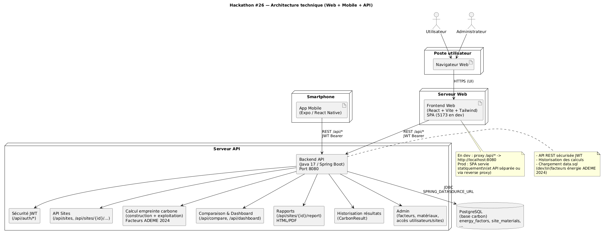
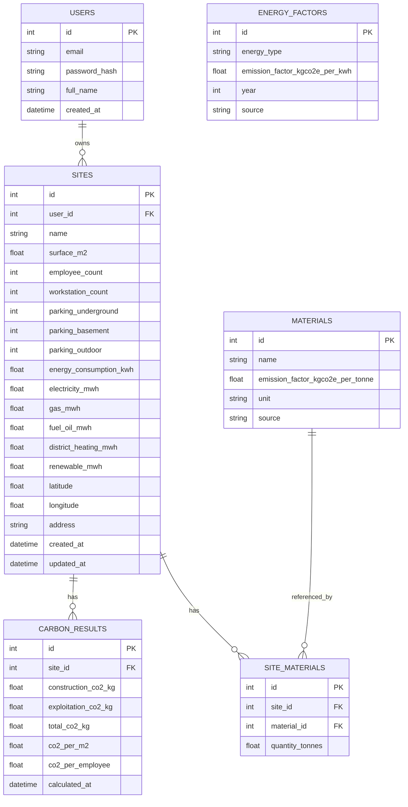
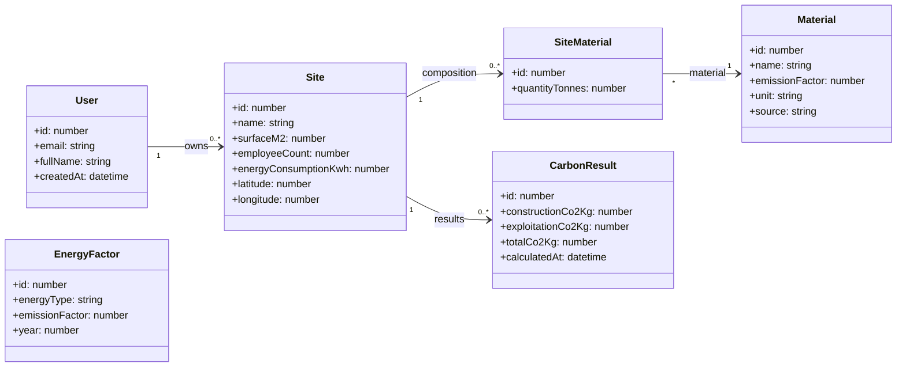
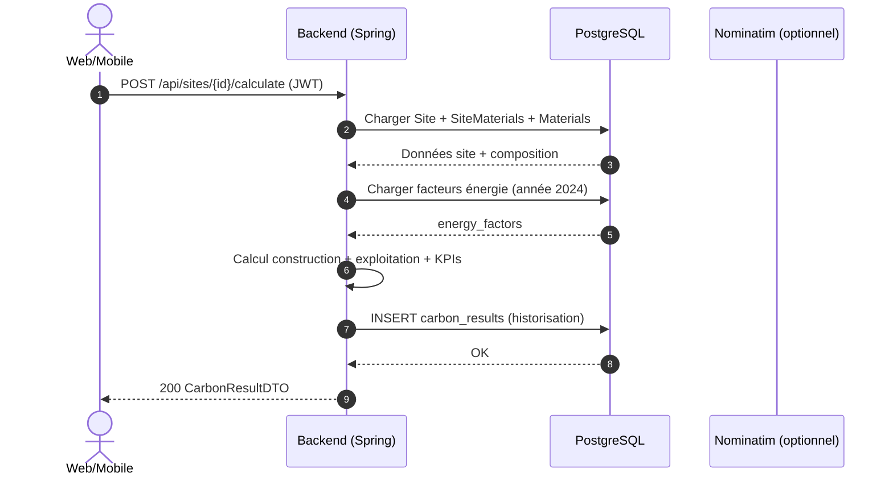

# Livrable — Hackathon #26 (Empreinte Carbone Site Physique)

**Projet :** Plateforme web + mobile de pilotage de l’empreinte carbone d’un portefeuille de sites physiques (construction + exploitation)  
**Client :** Capgemini  
**Dates :** 16–17 mars 2026  
**Dépôt :** `hackathon-26-carbon/`  

---

## 1) Résumé exécutif

Ce projet fournit un **socle full‑stack** permettant :

- La **création** et la **gestion** de sites (surface, employés, énergie, typologie, géolocalisation, composition matériaux ACV simplifiée).
- Le **calcul** de l’empreinte carbone par site, avec **historisation** des résultats.
- Un **dashboard web** (KPI, graphiques, carte/heatmap, comparaison multi‑sites).
- Une **application mobile** orientée terrain (consultation synthétique, saisie rapide exploitation + matériaux, historique).

Le calcul repose sur une approche pragmatique “hackathon” :

- **Construction** : somme des (tonnages matériaux × facteur kgCO₂e/tonne) via `site_materials`.
- **Exploitation** : consommation × facteurs énergie (base `energy_factors`, inspirée ADEME 2024).
- **KPIs** : total, par m², par employé.

---

## 2) Périmètre fonctionnel livré

### 2.1 Fonctionnalités backend (API REST)

- **Authentification JWT**
  - `POST /api/auth/register`
  - `POST /api/auth/login`
- **Sites**
  - CRUD + endpoints de consultation détaillée
  - Composition matériaux (ACV simplifiée) par site
- **Calcul + résultats**
  - Calcul construction + exploitation
  - **Historisation** (résultats successifs) + dernier résultat
- **Dashboard / comparaison**
  - Synthèse KPI, breakdown, comparaison multi‑sites
- **Exports**
  - Rapport site (HTML/PDF selon endpoints)
  - Rapport de scénario (selon endpoints dédiés)
- **Géocodage + carte**
  - Intégration Nominatim (OpenStreetMap) pour normaliser/obtenir des coordonnées

> Les routes exposées et citées dans le `README.md` racine incluent notamment :  
> `/api/sites`, `/api/results`, `/api/compare`, `/api/dashboard`, `/api/sites/{id}/composition`, `/api/sites/{id}/report`.

### 2.2 Fonctionnalités frontend web (React + Vite)

- Authentification, navigation par pages
- **Sites** : création / édition / détail, recalcul
- **Dashboard** : KPI + graphiques
- **Historique** : visualisation des résultats dans le temps
- **Comparaison** : multi‑sites (tableau + graphe)
- **Carte** : visualisation géographique (markers colorés selon tCO₂e)
- **Scénarios what‑if** : simulation “à la volée” (non persistée) et comparaison réel vs scénario
- **Export** : rapport HTML (base pour génération PDF)

### 2.3 Fonctionnalités mobile (Expo / React Native)

- Auth JWT (mêmes comptes que le web)
- Liste des sites + détail (KPI)
- **Recalcul** (année 2024) depuis l’app
- **Saisie rapide exploitation** (MWh/an) puis sauvegarde + recalcul
- **Saisie rapide matériaux** (tonnages) puis sauvegarde
- Historique des calculs par site

---

## 3) Architecture & choix techniques

### 3.1 Architecture logique

```text
Mobile (Expo)  ─┐
               ├──> Backend (Spring Boot, API REST, JWT) ───> PostgreSQL
Web (React)   ──┘
```

### 3.2 Schéma infra (logique)

> Ces schémas utilisent **Mermaid** (rendu natif GitHub/Cursor si activé).

Schéma d’architecture (image du repo) :



```mermaid
flowchart LR
  subgraph Utilisateurs
    U1[Utilisateur Web]
    U2[Utilisateur Mobile]
  end

  subgraph Clients
    WEB[Frontend Web<br/>React + Vite]
    MOB[Mobile<br/>Expo / React Native]
  end

  subgraph Plateforme
    RP[Reverse proxy (prod)<br/>Nginx / Plesk]
    API[Backend API<br/>Spring Boot + JWT]
    DB[(PostgreSQL)]
    GEO[Nominatim<br/>(OpenStreetMap)]
  end

  U1 --> WEB
  U2 --> MOB

  WEB -->|HTTP(S) /api/*| RP
  MOB -->|HTTP(S) API| RP
  RP --> API
  API --> DB
  API -->|HTTP| GEO
```

### 3.2 Stack technique

- **Backend** : Java 17, Spring Boot 3.x, Spring Security (JWT), JPA/Hibernate, PostgreSQL
- **Frontend web** : React 18 + Vite, Tailwind (UI), React Query, Recharts, Leaflet
- **Mobile** : Expo (expo-router), React Native
- **Géocodage** : Nominatim (OpenStreetMap)
- **Export PDF** : `openpdf` (dépendance Maven)

---

## 4) Structure du dépôt

```text
hackathon-26-carbon/
├── backend/                # Spring Boot + JPA + sécurité JWT
├── frontend/               # React + Vite (web)
├── mobile/                 # Expo / React Native (mobile)
├── docker-compose.yml      # Compose (actuellement backend uniquement)
├── README.md               # Vue globale + scénario de démo
├── PITCH-10MIN.md          # Script de pitch 10 minutes
├── DEPLOY_PLESK.md         # Guide de déploiement (Plesk + VPS)
└── docs/
    └── LIVRABLE.md         # (ce document)
```

---

## 5) Modèle de calcul carbone (méthode)

### 5.1 Construction (ACV simplifiée)

\[
CO₂_{construction} = \sum_i \bigl(q_i \;(\text{tonnes}) \times EF_i \;(\text{kgCO₂e/tonne})\bigr)
\]

où \(q_i\) est la quantité de matériau et \(EF_i\) son facteur d’émission.

### 5.2 Exploitation (annuelle)

\[
CO₂_{exploitation} = \sum_j \bigl(consommation_j \;(\text{kWh}) \times EF_j \;(\text{kgCO₂e/kWh})\bigr)
\]

Les facteurs énergie sont stockés en base (`energy_factors`) et initialisés en environnement dev via `backend/src/main/resources/data.sql` (inspiré ADEME 2024).

### 5.3 KPIs

- \(CO₂_{total} = CO₂_{construction} + CO₂_{exploitation}\)
- \(CO₂/m² = CO₂_{total} / surface_{m²}\)
- \(CO₂/employé = CO₂_{total} / nbEmployés\)

---

## 5bis) Schéma BDD (ERD)

Schéma relationnel principal (simplifié) aligné avec les entités JPA usuelles du projet.



---

## 5ter) Schémas UML

### UML (classes) — cœur du domaine



### UML (séquence) — recalcul d’un site



## 6) Installation & exécution (local)

### 6.1 Prérequis

- Java 17 + Maven
- Node.js + npm
- PostgreSQL (local) **ou** une base accessible (Docker possible)

### 6.2 Backend (Spring Boot)

Variables d’environnement principales :

- `SPRING_DATASOURCE_URL` (ex. `jdbc:postgresql://localhost:5432/carbon`)
- `SPRING_DATASOURCE_USERNAME`
- `SPRING_DATASOURCE_PASSWORD`
- `APP_JWT_SECRET`

Démarrage dev (avec chargement `data.sql`) :

```bash
cd backend
mvn spring-boot:run -Dspring-boot.run.profiles=dev
```

API : `http://localhost:8080`

### 6.3 Frontend web

```bash
cd frontend
npm install
npm run dev
```

Web : `http://localhost:5173`  
Le proxy `/api/*` vers `http://localhost:8080` est défini dans `frontend/vite.config.ts`.

### 6.4 Mobile (Expo)

Créer `mobile/.env` :

```bash
EXPO_PUBLIC_API_URL=http://192.168.X.Y:8080
```

Puis :

```bash
cd mobile
npm install
npm run start
```

Notes :

- Si `EXPO_PUBLIC_API_URL` n’est pas défini, l’app utilise l’API en ligne `https://api.carbontrack.nexsecure.fr`.
- Sur iOS, vérifier l’autorisation **Réseau local** pour Expo Go.

---

## 7) Exécution via Docker / déploiement (VPS/Plesk)

### 7.1 Docker Compose (état actuel)

Le fichier `docker-compose.yml` **ne déclare que** le service `backend` et pointe sur un contexte de build `./api.carbontrack.nexsecure.fr`.

Implications :

- Pour un usage local “tout‑en‑un” (backend + postgres + front), privilégier les lancements locaux décrits en section 6.
- Pour la prod, se référer à `DEPLOY_PLESK.md` (reverse‑proxy Nginx, secrets, backups).

### 7.2 Déploiement “Plesk-friendly”

Le guide `DEPLOY_PLESK.md` décrit :

- Backend + DB via Docker Compose, exposé en local VPS (idéalement `127.0.0.1:8080`)
- Reverse‑proxy Nginx pour publier l’API sur un sous‑domaine (ex. `api.carbontrack.nexsecure.fr`)
- Frontend Vite buildé en statique (`dist/`) et servi par Plesk
- Points clés : **APP_JWT_SECRET fort**, ne pas exposer Postgres, sauvegardes `pg_dump`

---

## 8) Scénario de démonstration (10 minutes)

Le script de pitch complet est disponible dans `PITCH-10MIN.md`.  
Déroulé synthétique :

- **Web**
  - Login → Dashboard → création d’un site → calcul → fiche site (KPI, breakdown)
  - Historique → Comparaison multi‑sites
  - Carte / heatmap
  - Scénario what‑if + export rapport
- **Mobile**
  - Login → liste des sites → détail d’un site
  - Saisie rapide exploitation + matériaux → recalcul → historique

---

## 9) Sécurité, données, conformité (niveau hackathon)

- **Authentification** : JWT (routes publiques limitées à `/api/auth/*`).
- **Secrets** : `APP_JWT_SECRET` requis (fort en prod).
- **CORS** : à contrôler en prod si API sur sous‑domaine (cf. `DEPLOY_PLESK.md`).
- **Données personnelles** : comptes utilisateurs (email, nom) + données “site” (non personnelles).  
  Recommandations production : registre de traitements, minimisation, politique de rétention, traces d’audit.

---

## 10) Qualité & tests

- Backend : présence de tests (ex. tests de service de calcul) sous `backend/src/test/`.
- Frontend : scripts `lint` + `vitest` disponibles (cf. `frontend/package.json`).

---

## 11) Limites connues & hypothèses

- **ACV simplifiée** : matériaux limités / tonnages estimatifs, pas de lots détaillés ni fin de vie.
- **Facteurs d’émission** : inspirés ADEME 2024 et stockés en base en dev ; pas de synchro temps réel avec l’API ADEME.
- **Docker compose** : fichier racine minimal (backend seul) — l’exécution locale recommandée est “par services”.
- **Scénarios what‑if** : simulation non persistée (outil d’atelier décisionnel).

---

## 12) Roadmap (industrialisation)

- **Méthodologie** : lots ACV plus fins, multi‑années, fin de vie, incertitudes + sensibilités.
- **Données** : connecteurs factures/GTB/GMAO, import en masse, gouvernance.
- **Produit** : objectifs (trajectoires), alertes, recommandations (télétravail/occupation), reporting institutionnel.
- **Tech** : CI/CD, environnement staging/prod, observabilité (traces/metrics), RBAC multi‑organisations.

---

## Annexes

- `README.md` : synthèse globale + commandes + scénario de démo
- `PITCH-10MIN.md` : script complet de démonstration
- `DEPLOY_PLESK.md` : guide de déploiement VPS/Plesk

